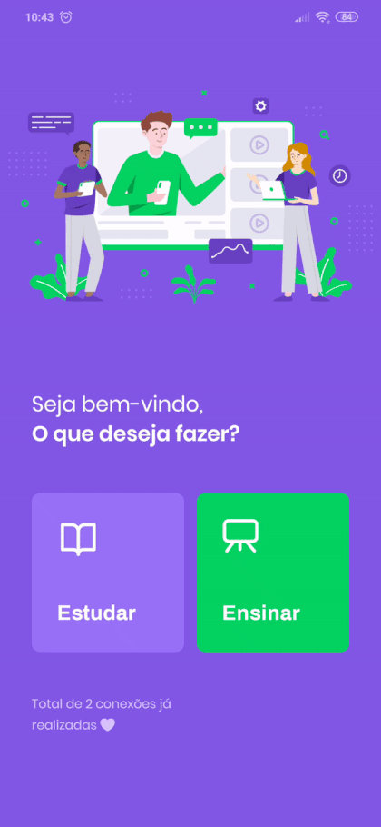

<h1 align="center">
  
</h1>

<p align="center">
  

  

  <a href="https://github.com/maykon-oliveira/nlw-2/blob/master/LICENSE.md">
    
  <a>
</p>

<p align="center">
  <a href="#rocket-tecnologias">Tecnologias</a>&nbsp;&nbsp;&nbsp;|&nbsp;&nbsp;&nbsp;
  <a href="#-projeto">Projeto</a>&nbsp;&nbsp;&nbsp;|&nbsp;&nbsp;&nbsp;
  <a href="#-frontend">Frontend</a>&nbsp;&nbsp;&nbsp;|&nbsp;&nbsp;&nbsp;
  <a href="#-instalação">Instalação</a>&nbsp;&nbsp;&nbsp;|&nbsp;&nbsp;&nbsp;
  <a href="#memo-licença">Licença</a>
</p>

<br>

---

## :hammer: Tecnologias

Esse projeto foi desenvolvido com as seguintes tecnologias:

- [Node.js](https://nodejs.org/en/)
- [React](https://reactjs.org)
- [React Native](https://facebook.github.io/react-native/)

## :memo: Projeto

Projeto desenvolvido durante a <strong>Next Level Week 2</strong>.

## :house: Frontend

<h1 align="center">
    
</h1>

<!-- ## :iphone: Mobile

<h1 align="center">
    
</h1> -->

## :wrench: Instalação

```bash
# Clone este repositório
$ git clone git@github.com:maykon-oliveira/nlw-2.git

# Navegue até a pasta server e execute os seguintes comandos:
$ yarn knex:migrate
$ yarn start

# Depois disso, entre na pasta web e execute o comando:
$ yarn start
```

## 🐳 Deploy no docker

```bash
# Na pasta raiz do projeto
$ sudo docker-compose up -d
```

http://localhost:1337

## :scroll: Licença

Esse projeto está sob a licença MIT. Veja o arquivo [LICENSE](LICENSE.md) para mais detalhes.

---

Feito com :blue_heart: by [Maykon Oliveira](https://www.linkedin.com/in/maykon-oliveira/)
